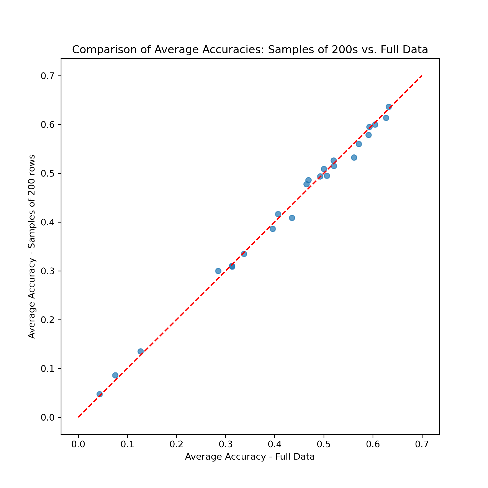
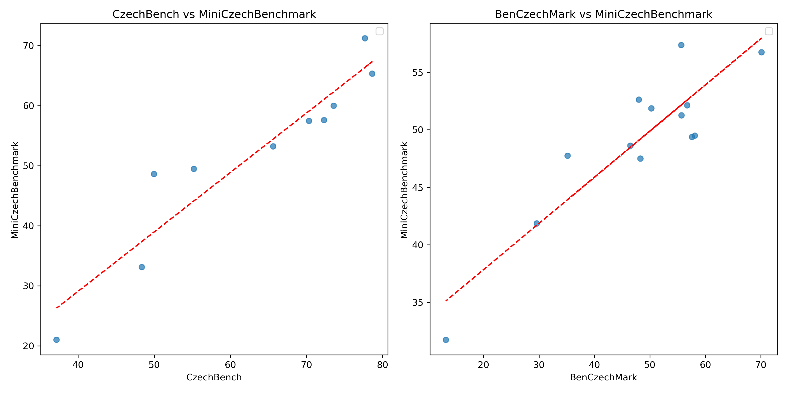

# MiniCzechBenchmark
Selected 4 x 200 multiple-choice questions to test large language models.

## Datasets (200 randomly selected questions each)
 * [MiniAGREE](https://huggingface.co/datasets/simecek/mini_agree) (Czech language)
 * [MiniCzechNews](https://huggingface.co/datasets/simecek/mini_czech_news) (news categorization)
 * [MiniKlokánek](https://huggingface.co/datasets/simecek/mini_klokanek) (math)
 * [MiniCTKFacts](https://huggingface.co/datasets/simecek/mini_ctkfacts) (reasoning)
 * Sumarizace (text summarization) - t.b.d.

To evaluate a model on MiniCzechBenchmark, use [minicz_bench.ipynb](minicz_bench.ipynb), either interactively or via [Papermill](https://github.com/nteract/papermill)

```
papermill minicz_bench.ipynb output.ipynb -p MODEL "CohereForAI/aya-expanse-8b" -p DATA_SIZE "mini"
```

The full datasets and few-shot prompts come from the [CzechBench](https://gitlab.com/jirkoada/czech-bench) benchmark. Special thanks to Adam Jirkovsky and the authors of the original datasets for this resource.

## Results (Nov 9, 2024)

| model                                            |   average_accuracy |   agree_accuracy |   czech_news_accuracy |   klokanek_accuracy |   ctkfacts_accuracy |   average_validity |   runtime[min] |
|:-------------------------------------------------|-------------------:|-----------------:|----------------------:|--------------------:|--------------------:|-------------------:|---------------:|
| gemini-1.5-pro-latest                            |               0.72 |             0.78 |                  0.85 |                0.53 |                0.72 |               1    |              |
| claude-3-5-sonnet-20241022                       |               0.72 |             0.86 |                  0.84 |                0.48 |                0.7  |               1    |              |
| claude-3-5-sonnet-20240620                       |               0.71 |             0.88 |                  0.81 |                0.44 |                0.72 |               1    |              |
| gpt-4o                                           |               0.65 |             0.74 |                  0.83 |                0.36 |                0.7  |               1    |              |
| unsloth/Qwen2.5-72B-Instruct-bnb-4bit            |               0.64 |             0.58 |                  0.86 |                0.44 |                0.68 |               1    |          17.32 |
| Qwen/Qwen2.5-72B-Instruct-GPTQ-Int4              |               0.64 |             0.59 |                  0.84 |                0.44 |                0.69 |               1    |          52.27 |
| unsloth/Mistral-Large-Instruct-2407-bnb-4bit     |               0.64 |             0.64 |                  0.82 |                0.36 |                0.72 |               1    |          28.92 |
| gpt-4-turbo                                      |               0.64 |             0.68 |                  0.83 |                0.34 |                0.68 |               1    |              |
| claude-3-5-haiku-20241022                        |               0.63 |             0.64 |                  0.84 |                0.31 |                0.73 |               1    |              |
| gemini-1.5-flash-latest                          |               0.62 |             0.62 |                  0.82 |                0.34 |                0.69 |               0.99 |              |
| Qwen/Qwen2.5-32B-Instruct                        |               0.61 |             0.65 |                  0.78 |                0.4  |                0.62 |               1    |           6.08 |
| google/gemma-2-27b-it                            |               0.6  |             0.57 |                  0.8  |                0.32 |                0.72 |               1    |           5.36 |
| unsloth/Meta-Llama-3.1-70B-Instruct-bnb-4bit     |               0.6  |             0.55 |                  0.8  |                0.34 |                0.7  |               1    |          14.77 |
| fsaudm/Meta-Llama-3.1-70B-Instruct-NF4           |               0.6  |             0.55 |                  0.8  |                0.32 |                0.71 |               0.99 |          14.81 |
| claude-3-haiku-20240307                          |               0.58 |             0.57 |                  0.8  |                0.28 |                0.65 |               1    |              |
| gemini-1.5-flash-8b-latest                       |               0.58 |             0.56 |                  0.77 |                0.24 |                0.74 |               1    |              |
| gpt-4o-mini                                      |               0.58 |             0.58 |                  0.8  |                0.31 |                0.6  |               1    |              |
| speakleash/Bielik-11B-v2.3-Instruct              |               0.57 |             0.55 |                  0.8  |                0.24 |                0.7  |               1    |           2.82 |
| unsloth/c4ai-command-r-08-2024-bnb-4bit          |               0.57 |             0.48 |                  0.82 |                0.26 |                0.72 |               1    |           6.29 |
| AMead10/c4ai-command-r-08-2024-awq               |               0.57 |             0.47 |                  0.83 |                0.28 |                0.69 |               1    |          34.06 |
| mistralai/Mistral-Small-Instruct-2409            |               0.56 |             0.4  |                  0.82 |                0.28 |                0.74 |               1    |           4.7  |
| CohereForAI/aya-expanse-32b                      |               0.56 |             0.5  |                  0.78 |                0.28 |                0.67 |               1    |           4.41 |
| google/gemma-2-9b-it                             |               0.53 |             0.48 |                  0.78 |                0.25 |                0.61 |               1    |           2.84 |
| gpt-3.5-turbo                                    |               0.53 |             0.48 |                  0.76 |                0.28 |                0.59 |               1    |              |
| Qwen/Qwen2.5-7B-Instruct                         |               0.53 |             0.37 |                  0.72 |                0.31 |                0.71 |               1    |           1.57 |
| CohereForAI/aya-23-35B                           |               0.52 |             0.48 |                  0.76 |                0.24 |                0.6  |               1    |           4.88 |
| NousResearch/Hermes-3-Llama-3.1-8B               |               0.52 |             0.44 |                  0.7  |                0.26 |                0.68 |               1    |           1.45 |
| CohereForAI/aya-expanse-8b                       |               0.52 |             0.48 |                  0.76 |                0.23 |                0.58 |               1    |           1.39 |
| mistralai/Mixtral-8x7B-Instruct-v0.1             |               0.51 |             0.3  |                  0.76 |                0.26 |                0.73 |               0.98 |          35.98 |
| mistralai/Ministral-8B-Instruct-2410             |               0.51 |             0.39 |                  0.68 |                0.28 |                0.68 |               1    |           1.59 |
| meta-llama/Llama-3.1-8B-Instruct                 |               0.5  |             0.43 |                  0.75 |                0.2  |                0.6  |               1    |           1.48 |
| mistralai/Mistral-Nemo-Instruct-2407             |               0.49 |             0.31 |                  0.72 |                0.26 |                0.68 |               1    |           2.23 |
| google/gemma-2-2b-it                             |               0.49 |             0.43 |                  0.64 |                0.3  |                0.57 |               1    |           1.21 |
| mistralai/Mistral-7B-Instruct-v0.3               |               0.48 |             0.28 |                  0.68 |                0.26 |                0.68 |               1    |           1.8  |
| meta-llama/Meta-Llama-3-8B-Instruct              |               0.48 |             0.31 |                  0.72 |                0.29 |                0.58 |               1    |           1.45 |
| CohereForAI/aya-23-8B                            |               0.46 |             0.24 |                  0.71 |                0.28 |                0.62 |               1    |           1.39 |
| meta-llama/Llama-3.2-3B-Instruct                 |               0.41 |             0.32 |                  0.5  |                0.3  |                0.53 |               1    |           0.87 |
| Qwen/Qwen2.5-3B-Instruct                         |               0.41 |             0.38 |                  0.41 |                0.27 |                0.57 |               1    |           1.07 |
| microsoft/Phi-3.5-mini-instruct                  |               0.39 |             0.18 |                  0.57 |                0.24 |                0.55 |               1    |           2.12 |
| Qwen/Qwen2.5-1.5B-Instruct                       |               0.34 |             0.38 |                  0.27 |                0.27 |                0.42 |               1    |           0.73 |
| unsloth/Llama-3.1-Nemotron-70B-Instruct-bnb-4bit |               0.33 |             0    |                  0.7  |                0.02 |                0.62 |               0.46 |          14.5  |
| ibm-granite/granite-3.0-8b-instruct              |               0.33 |             0.23 |                  0.53 |                0.24 |                0.32 |               1    |           2.25 |
| microsoft/Phi-3-mini-4k-instruct                 |               0.32 |             0.09 |                  0.54 |                0.18 |                0.46 |               0.83 |           1.9  |
| microsoft/Phi-3-mini-128k-instruct               |               0.31 |             0.13 |                  0.62 |                0    |                0.5  |               0.66 |           2.13 |
| mistralai/Mistral-7B-Instruct-v0.1               |               0.3  |             0.2  |                  0.44 |                0.02 |                0.54 |               0.77 |           1.82 |
| ibm-granite/granite-3.0-2b-instruct              |               0.21 |             0.22 |                  0.2  |                0.08 |                0.34 |               0.84 |           1.2  |
| microsoft/Phi-3-medium-4k-instruct               |               0.14 |             0.32 |                  0    |                0.22 |                0    |               0.42 |           1.11 |
| microsoft/Phi-3-medium-128k-instruct             |               0.09 |             0.2  |                  0    |                0.15 |                0    |               0.24 |           1.64 |
| meta-llama/Llama-3.2-1B-Instruct                 |               0.06 |             0    |                  0.07 |                0.18 |                0    |               0.21 |           0.45 |
| HuggingFaceTB/SmolLM-1.7B-Instruct               |               0.02 |             0    |                  0    |                0.06 |                0    |               0.05 |           0.78 |

You can also download results as [CSV table](minicz_bench.csv).

## Comparison to Full Datasets 

Comparison of average accuracies (over 4 datasets) of 24 open models (mix of Lammas, Mistrals, Gemmas, Qwens...) on MiniCzechBenchmark and on full datasets.

The Spearman rank-order correlation coefficient between average accuracies is $>0.996$. The maximum absolute difference between average accuracies is $0.0291$.



## Comparison to CzechBench and BenCzechMark (Oct 31, 2024)

Datasets included in *MiniCzechBenchmark* were selected to be representative of [CzechBench](https://huggingface.co/spaces/CIIRC-NLP/czechbench_leaderboard), so it is not surprising that the shared models achieve similar performance on both benchmarks, with a Spearman rank-order correlation coefficient of $0.99$.

If we compare *MiniCzechBenchmark* results to the [recently](https://huggingface.co/blog/benczechmark) introduced [BenCzechMark](https://huggingface.co/spaces/CZLC/BenCzechMark), the Spearman rank-order correlation coefficient is approx. $0.65$.



## Benchmark Runs Outputs

At the end of [evaluation script](./minicz_bench.ipynb), we save the results in the following format:
- `model`: model name
- `datasets`: dataset names
- `raw outputs`: raw outputs of the model
- `dfs`: dataframes with the processed results
- `metrics`: accuracies of the model on each dataset, also percentages of valid answers
- `timing_results`: timing results of the model on each dataset (in seconds)

The results are saved in the [bench_runs](./bench_runs) directory.

